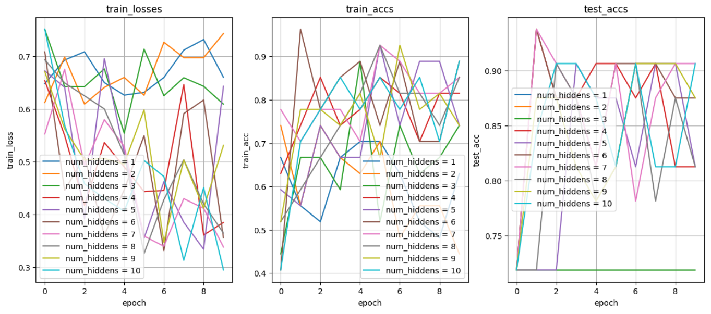

# Kaggle-Competition

### &#9733; **Tiantic竞赛**（2025.5）:  
-  **成绩：** `0.75837`
-  **代码链接：** [Kaggle Notebook](https://www.kaggle.com/code/mtscoptor/titanic) &#8192; [GitHub](Titanic/titanic.ipynb)
-  **项目亮点：**  
&#8192; **1.** 本项目利用深度学习方法单隐藏层感知机结构代替原示例中的传统机器学习方法随机森林分类器  
&#8192; **2.** 本项目中对单隐藏层感知机的隐藏层在设置1-10个隐藏元素时预测的性能进行了分析，并用可视化图像表达出来，如图    

### &#9733; **House_prices竞赛**（2025.6）:  
-  **成绩：** `0.16295` --> `0.15162`
-  **代码链接：** [Kaggle Notebook](https://www.kaggle.com/code/mtscoptor/house-prices) &#8192; [GitHub](House_prices/house_prices.ipynb)
-  **项目亮点：**  
&#8192; **1.** 鉴于本项目训练集样本量较少，因而采用k折交叉验证法进行损失分析  
&#8192; **2.** Version2对学习率、轮次等超参数进行优化，优化成果`0.16295` --> `0.15162`，优化率`7%`
